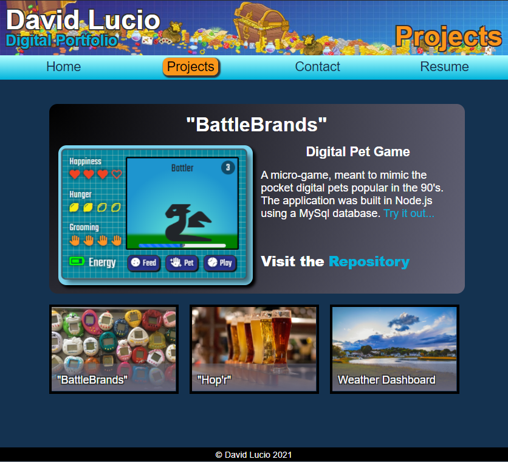

# Portfolio

## By: David Lucio

### Table of Contents

* [Installation](#installation)
* [Usage](#usage)
* [Contributing](#contributing)
* [Tests](#tests)
* [Questions](#questions)

&nbsp;

&nbsp;

> ## **Description** 
> ### Professional portfolio
>
> ### **v4.2.0** (9/7/21)
> Added newest project
> 
> ### **v4.1.0** (8/26/21)
> Complete overhaul of the project, using React.js
> 
> ### **v3.0.1** (8/11/21)
> Added new project and corresponding screenshots.
> 
> ### **v2.0.2** (7/13/21)
> Updated portfolio template. Now includes updated links to various projects and repos, as well as screenshots, and a link to GitHub.
> 
> ### **v1.0** (6/22/21)
> Recreated template portfolio using placeholder links and stock images. Also used some of my personal resources and brand coloring as variables. For the most part, I tried to make it 1-to-1, but I took a few liberties with functionality. 
> 
> &nbsp;
> 
> ## **Tech used** 
> 

> &nbsp;
> 
> ## **Tech featured in examples** 
> 

>

 

*Completed Assignment*: [Deployment Link](https://davidlucio.github.io/portfolio/)

&nbsp;

## **Installation**  
N/A (Access directly via [Deployment Link](https://davidlucio.github.io/portfolio/))

&nbsp;

## **Usage**  
Please contact david.a.lucio@gmail.com for additional information regarding resume.  

&nbsp;

## **Contributing**
N/A  

&nbsp;

## **Tests**  
N/A  

&nbsp;

## **Questions**  

Email: david.a.lucio@gmail.com

GitHub: [davidlucio](http://github.com/davidlucio)  

LinkedIn: [davidlucio](https://www.linkedin.com/in/davidlucio)